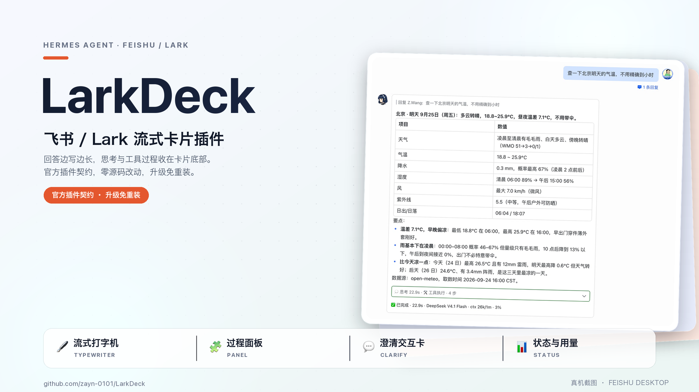

# LarkDeck

> **Replies appear character by character in Feishu, with tool steps in a collapsible panel.**
> When reasoning display is enabled and Hermes emits reasoning deltas, the panel can show them too.
> LarkDeck is a [Hermes Agent](https://github.com/NousResearch/hermes-agent) plugin built on
> Feishu CardKit 2.0, with no Hermes source patches. The main reply streams in its card; long
> answers continue in follow-up cards, and clarify prompts use separate interactive cards.

[](https://github.com/zayn-0101/LarkDeck/releases)
[](https://github.com/NousResearch/hermes-agent)
[](LICENSE)

[中文](README.md) | [English](README.en.md)



## Features

- **Streaming and long answers** — text grows in the main card; answers that exceed one card continue in follow-up cards without replaying earlier text.
- **Process panel** — tool steps stay in a collapsible bottom panel, grouped by round; reasoning
  appears when display is enabled and Hermes emits reasoning deltas. Argument previews are shortened
  and obvious credentials are masked.
- **Clarify cards** — answer with a dropdown, multi-select, text input, or buttons on a card separate from the main reply.
- **Status and usage** — green / red / yellow border for done / failed / stopped; the footer shows elapsed time, model and context usage.
- **Bilingual UI** — localized card labels follow the Feishu client language; model output is never translated.
- **Fallback** — when card updates cannot continue, send/edit operations return to Hermes' official
  implementation; some CardKit errors can degrade to full-card replacement on the same message. If
  a message is withdrawn or deleted, Hermes decides whether to resend it.
- **Text formatting** — unmatched `**` markers are removed and H1–H3 headings are converted to bold text to avoid oversized headings in cards.

## Quick start

Prerequisites: Hermes Agent 0.21.x running, with Feishu / Lark app credentials (see the [installation guide](docs/guide/installation.md)).

```bash
git clone https://github.com/zayn-0101/LarkDeck.git larkdeck
cd larkdeck
./install.sh          # add --copy for NAS / containers
```

Enable the plugin in `~/.hermes/config.yaml`:

```yaml
plugins:
  enabled:
    - larkdeck
```

Restart the gateway:

```bash
hermes gateway restart
```

Verify: send `/larkdeck status` to the bot in Feishu. A seven-row summary card (`Platform takeover` and `Hooks` both `✅`) means the plugin has taken over. Send `/larkdeck status --detail` for the capability probe and the six process-wide records. The gateway log shows a `[larkdeck]` startup self-check line; on failure it logs `ERROR` and leaves the official adapter working, so Feishu never breaks.

Upgrade: `git pull && hermes gateway restart` for a symlink install. For a copy install, `git pull`, move the old directory aside, re-run `./install.sh --copy`, then restart — the script never overwrites an existing target; see the [installation guide](docs/guide/installation.md). The gateway must be restarted; modules are not hot-reloaded. Uninstall: remove `larkdeck` from `plugins.enabled`, then delete `~/.hermes/plugins/larkdeck/`.

## Configuration

Minimal `~/.hermes/config.yaml`:

```yaml
plugins:
  stream_reasoning_deltas: true   # needed to see reasoning text; off by default in Hermes
  entries:
    larkdeck:
      settings:
        cards: true
        show_reasoning: auto      # follows Hermes /reasoning on|off
        streaming_print_ms: 15    # typing speed; 0 disables
        unified_panel: true
```

`LARKDECK_<KEY>` environment variables override config values (e.g. `LARKDECK_CARDS=0`); precedence is environment > `config.yaml` > default. See [Configuration](docs/guide/configuration.md) for every key, default and example; `/larkdeck config` shows effective values and `/larkdeck config reload` re-reads them.

The current structured engine always uses CardKit: `native_transport: patch` does not switch this path, and `panel_color_tags: false` does not remove its panel colors. These settings are no-ops for this path. Set `streaming_print_ms: 0` to disable the typing animation.

## Commands

| Command | Purpose |
|---|---|
| `/larkdeck status` | Overview: version, configured transport, takeover, hooks, reasoning display and failure counts |
| `/larkdeck status --detail` | Full diagnostics: capability probe, adapter/contract details, six process-wide records |
| `/larkdeck config` | Read-only view of effective settings and their source |
| `/larkdeck config reload` | Re-read settings from Hermes; aborts as a whole if any key fails |
| `/larkdeck help` | Usage |
| `/reasoning on\|off` | Hermes command: toggle reasoning text; `show_reasoning: auto` follows within ~1s |

See [Commands](docs/guide/commands.md).

## Compatibility and limits

- **Environment**: Hermes Agent 0.21.x (verified on 0.21.1 / 0.21.4), with the official `feishu` platform available in the same process; cannot coexist with plugins that also take over the same `feishu` platform or patch Hermes source.
- **Fallback and client differences**: cards are an enhancement. When card updates cannot continue,
  send/edit operations return to Hermes' official implementation; some CardKit errors degrade to
  full-card replacement on the same message. If a message is withdrawn or deleted, Hermes decides
  whether to resend it. Clients that do not support card 2.0 may render fewer components or simpler
  forms; card chrome follows the client language, while model output and some markdown labels are
  language-fixed. See [Card capabilities](docs/guide/card-capabilities.md).
- **Reasoning text**: requires Hermes `plugins.stream_reasoning_deltas` (off by default); without it the panel shows tool steps only, and `/larkdeck status --detail` says why.
- **Command timing**: in the Feishu gateway, commands sent while a reply is streaming are queued until the turn ends; the CLI / TUI runs them immediately.
- **Scope of counters**: footer metrics and `/larkdeck status` records are process-wide, not per conversation; after a long answer splits cards, `/stop` recolors only the newest card.

## Documentation

The README, contribution guide, changelog, license and GitHub community files stay at the
repository root. The installation manual and detailed user and developer guides live under
`docs/guide/` and `docs/development/`; see the [documentation map](docs/README.md) for the full
index.

## Acknowledgements

LarkDeck's design and implementation were inspired by several excellent Feishu / Lark card projects in the community. Our thanks to the following projects and their authors:

- [Cheerwhy/hermes-lark-streaming](https://github.com/Cheerwhy/hermes-lark-streaming)
- [Aowen-Nowor/hermes-lark-streaming](https://github.com/Aowen-Nowor/hermes-lark-streaming)
- [BcubBo/lark-hls-v2](https://github.com/BcubBo/lark-hls-v2)
- [monkey2jack/aiduPOP](https://github.com/monkey2jack/aiduPOP)
- [techysy/hermes-fry-cards](https://github.com/techysy/hermes-fry-cards)
- [baileyh8/hermes-feishu-streaming-card](https://github.com/baileyh8/hermes-feishu-streaming-card)

Thanks also to [Hermes Agent](https://github.com/NousResearch/hermes-agent) and the [Feishu Open Platform](https://open.feishu.cn/) for the public capabilities they provide.

LarkDeck is an independent implementation and is not affiliated with the projects above; all project names and work belong to their respective authors.

## Contributing

Issues and pull requests are welcome; please read the [contributing guide](CONTRIBUTING.md) first.

## License

MIT — see [LICENSE](LICENSE).
